# React Performance

## React Dev Tools Profiler

### Before optimization

1. Filtering countries by Antarctic region:

- Commit Duration: 2.7s
- Render Duration: 17.7ms

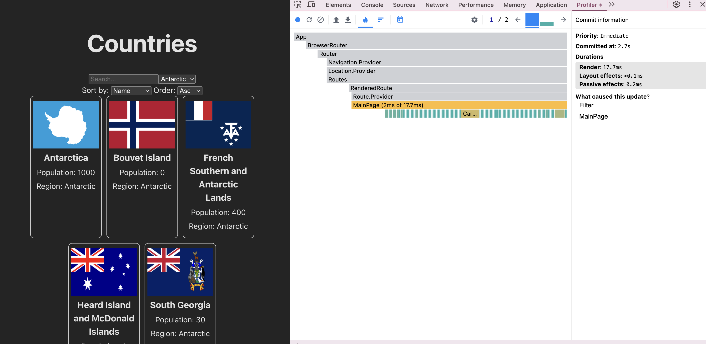
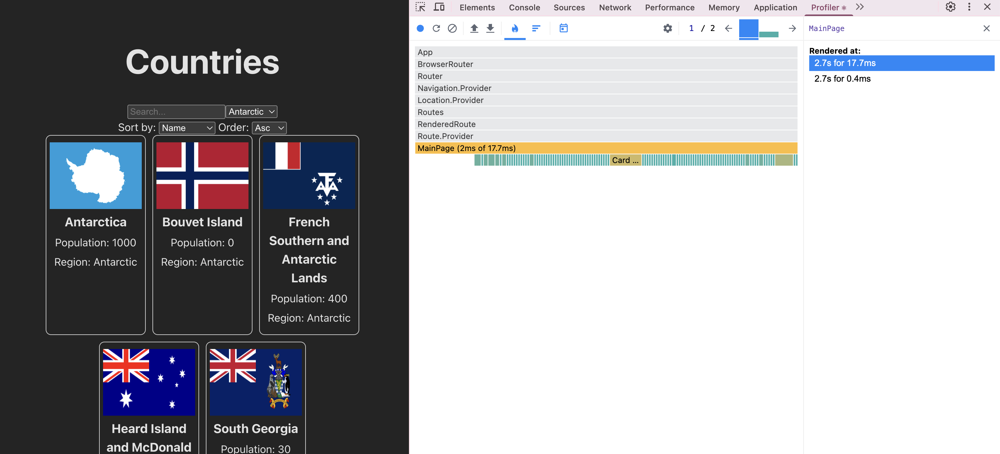
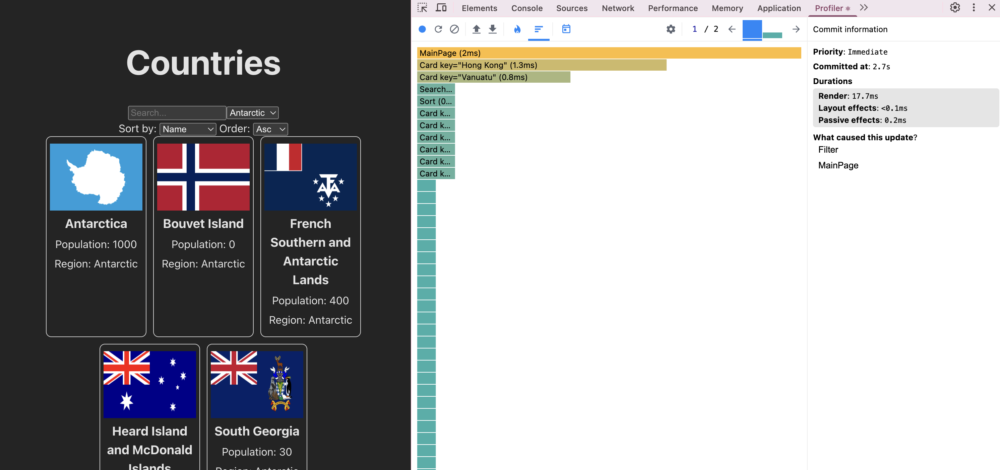

2. Sorting countries: first by name in descending order, then by population in descending order, then by population in ascending order:

- Commit Duration: 4.6s
- Render Duration: 1.5ms

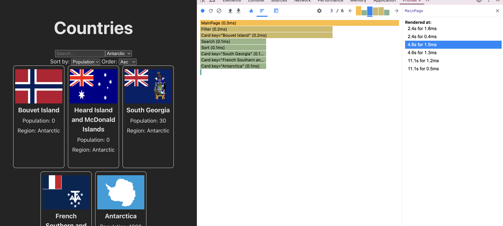
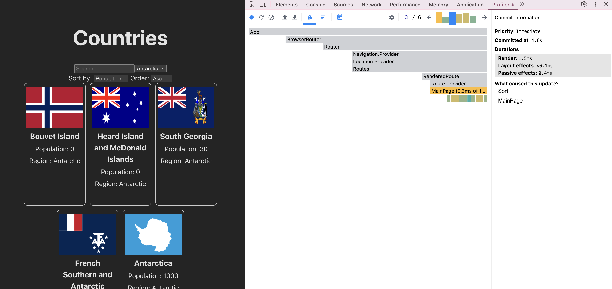

3. Searching countries by 'ant':

- Commit Duration: 2.3s
- Render Duration: 0.5ms

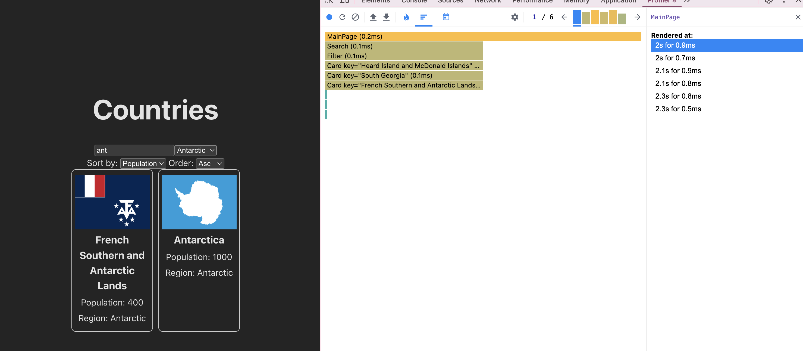
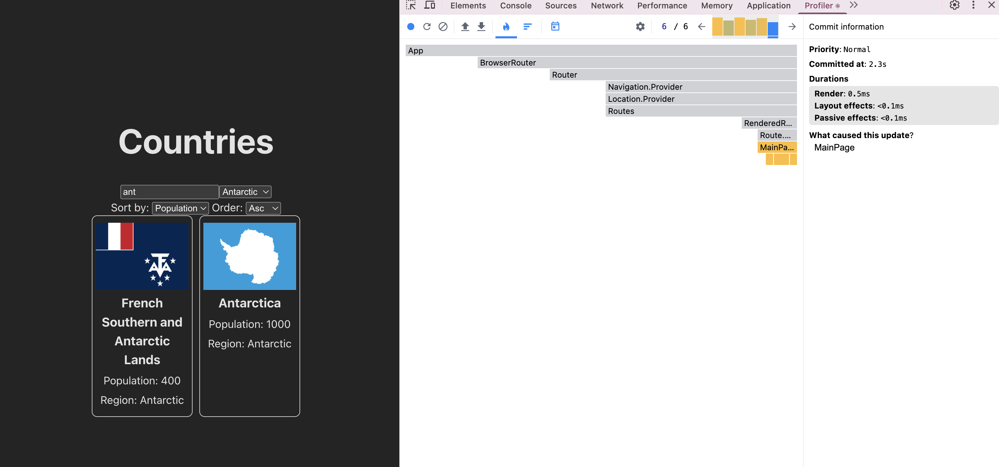

### After optimization

1. Filtering countries by Antarctic region:

- Commit Duration: 2.4s
- Render Duration: 2.5ms

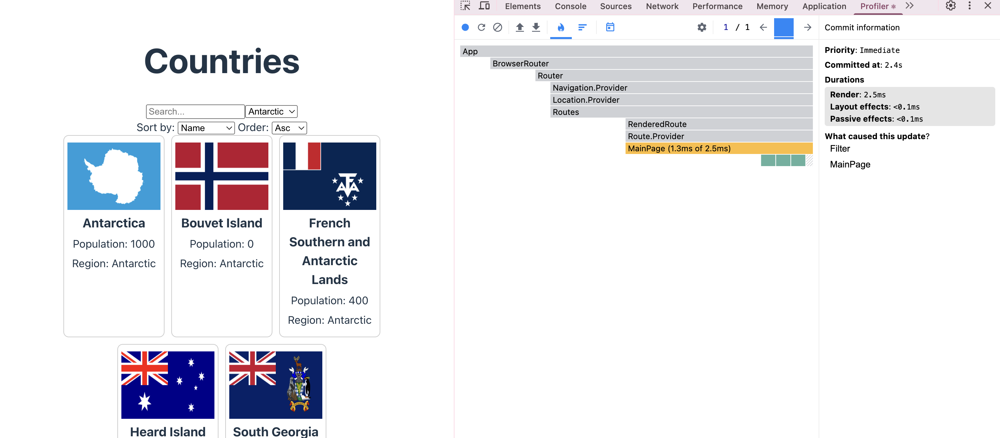
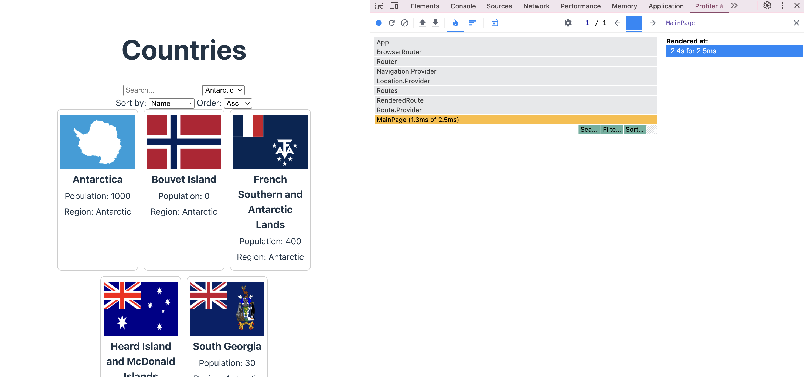
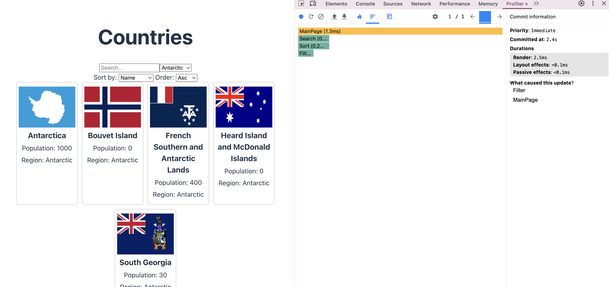

2. Sorting countries: first by name in descending order, then by population in descending order, then by population in ascending order:

- Commit Duration: 4.5s
- Render Duration: 0.9ms

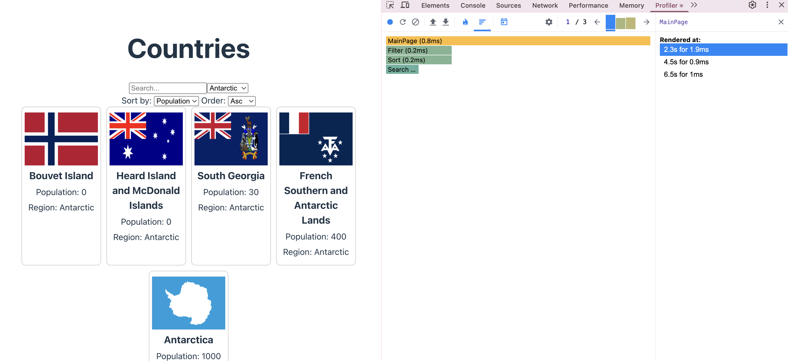
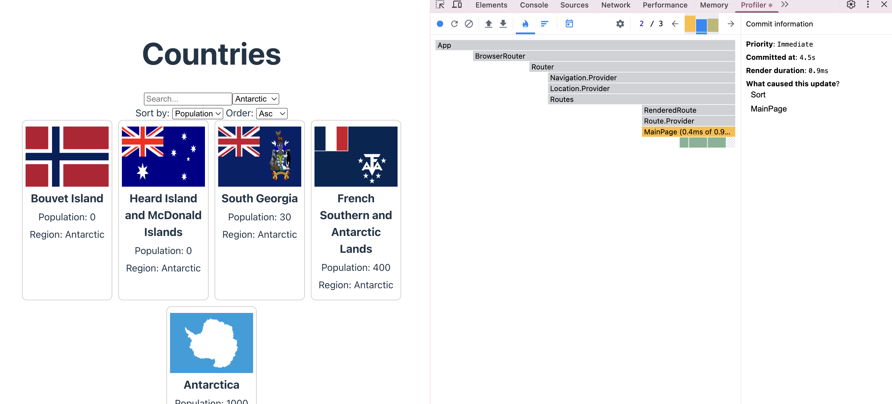

3. Searching countries by 'ant':

- Commit Duration: 1.3s
- Render Duration: 0.8ms

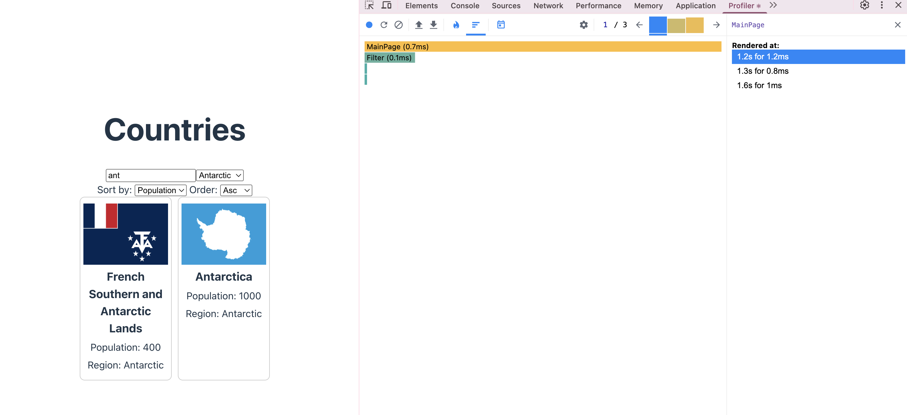
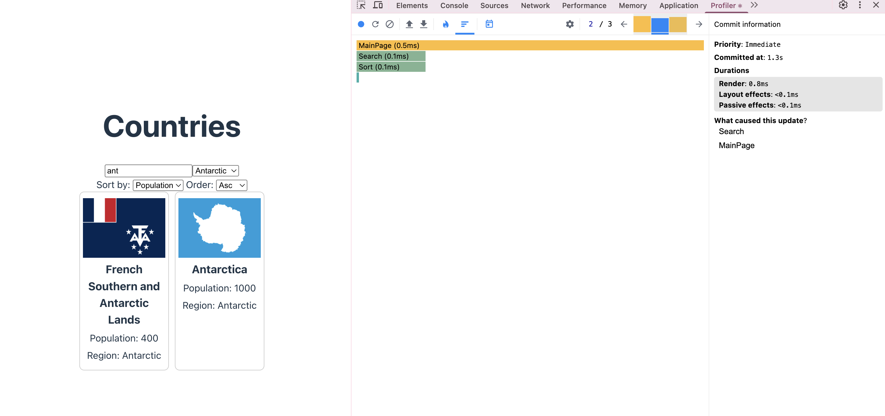
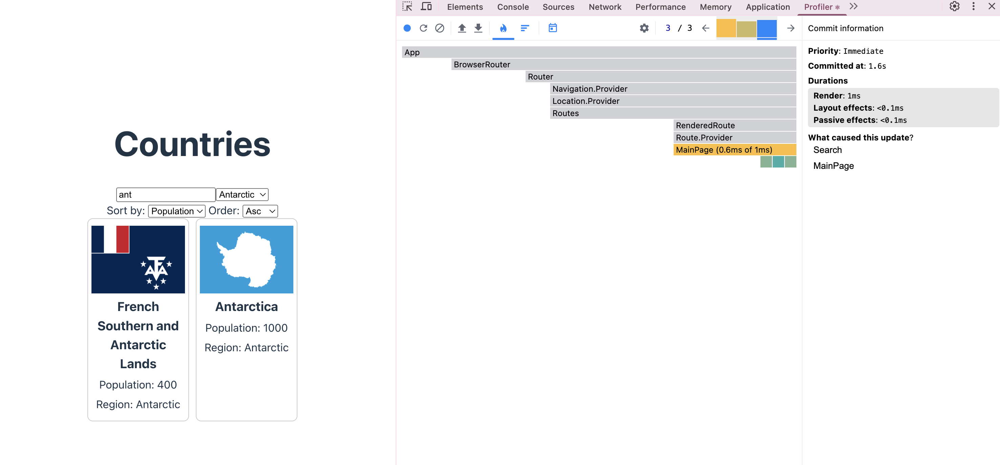
